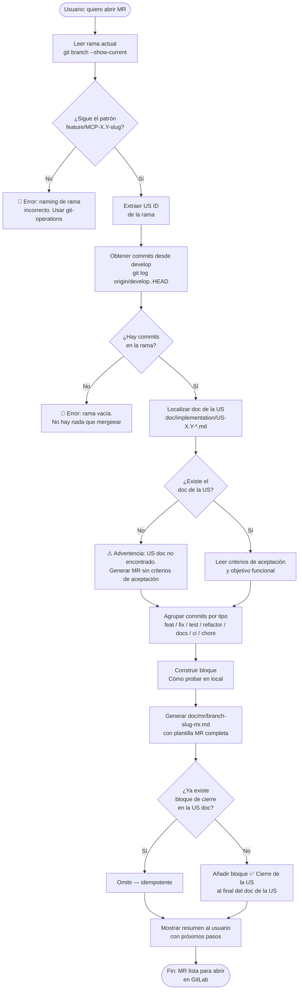
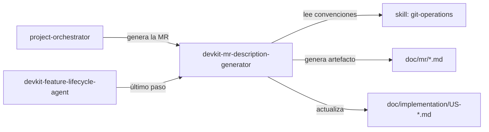

# MR Description Generator — Visión general

## Diagrama de flujo



## Responsabilidades

| Paso | Qué hace |
|---|---|
| Detección de rama | Parsea el nombre para extraer el ID de la US |
| Lectura de commits | `git log origin/develop..HEAD` — solo commits de esta rama |
| Localización del doc | `find doc/implementation -name "US-<id>-*.md"` |
| Generación del MR doc | Inyecta datos en `references/mr-template.md` |
| Bloque "Cómo probar" | Genera pasos locales sin Docker (guardrail del orquestador) |
| Cierre de la US | Añade `## ✅ Cierre de la US` al doc de implementación |

## Inputs / Outputs

```
Inputs:
  - git: rama actual + commits desde develop
  - filesystem: doc/implementation/US-<id>-*.md

Outputs:
  - doc/mr/<branch-slug>-mr.md       (NUEVO)
  - doc/implementation/US-<id>-*.md  (MODIFICADO — bloque de cierre añadido)
```

## Integración en el ecosistema


