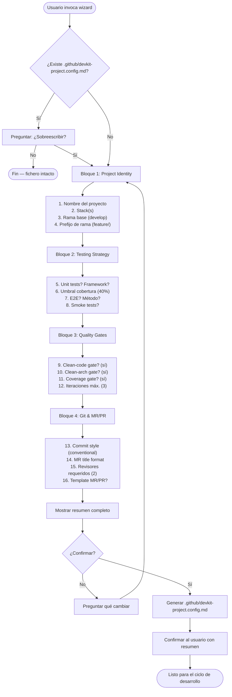
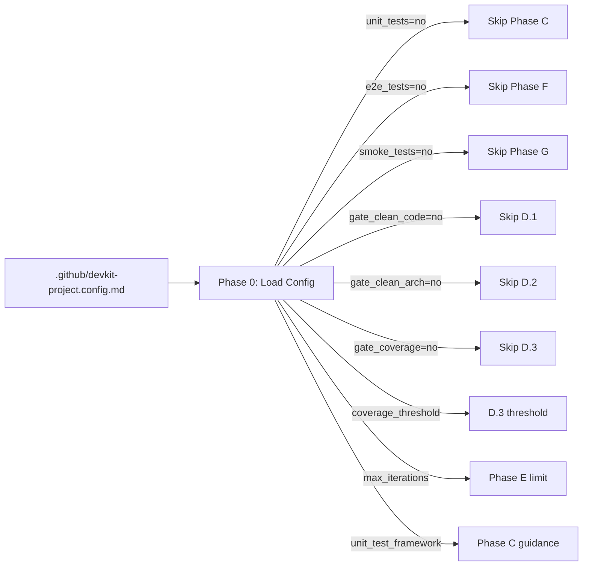

# Project Config Wizard — Flow Overview

```mermaid
flowchart TD
    A([Usuario invoca wizard]) --> B{¿Existe .github/devkit-project.config.md?}
    B -- Sí --> C[Preguntar: ¿Sobreescribir?]
    C -- No --> Z([Fin — fichero intacto])
    C -- Sí --> D
    B -- No --> D[Bloque 1: Project Identity]
    D --> D1["1. Nombre del proyecto
    2. Stack(s)
    3. Rama base (develop)
    4. Prefijo de rama (feature/)"]
    D1 --> E[Bloque 2: Testing Strategy]
    E --> E1["5. Unit tests? Framework?
    6. Umbral cobertura (40%)
    7. E2E? Método?
    8. Smoke tests?"]
    E1 --> F[Bloque 3: Quality Gates]
    F --> F1["9.  Clean-code gate? (sí)
    10. Clean-arch gate? (sí)
    11. Coverage gate? (sí)
    12. Iteraciones máx. (3)"]
    F1 --> G[Bloque 4: Git & MR/PR]
    G --> G1["13. Commit style (conventional)
    14. MR title format
    15. Revisores requeridos (2)
    16. Template MR/PR?"]
    G1 --> H[Mostrar resumen completo]
    H --> I{¿Confirmar?}
    I -- No --> J[Preguntar qué cambiar]
    J --> D
    I -- Sí --> K[Generar .github/devkit-project.config.md]
    K --> L[Confirmar al usuario con resumen]
    L --> M([Listo para el ciclo de desarrollo])
```

## Config activation rules consumed by `devkit-development-lifecycle`

```mermaid
flowchart LR
    CONFIG[.github/devkit-project.config.md] --> P0[Phase 0: Load Config]
    P0 -- unit_tests=no --> SKIP_C[Skip Phase C]
    P0 -- e2e_tests=no --> SKIP_F[Skip Phase F]
    P0 -- smoke_tests=no --> SKIP_G[Skip Phase G]
    P0 -- gate_clean_code=no --> SKIP_D1[Skip D.1]
    P0 -- gate_clean_arch=no --> SKIP_D2[Skip D.2]
    P0 -- gate_coverage=no --> SKIP_D3[Skip D.3]
    P0 -- coverage_threshold --> D3[D.3 threshold]
    P0 -- max_iterations --> E[Phase E limit]
    P0 -- unit_test_framework --> C[Phase C guidance]
```
