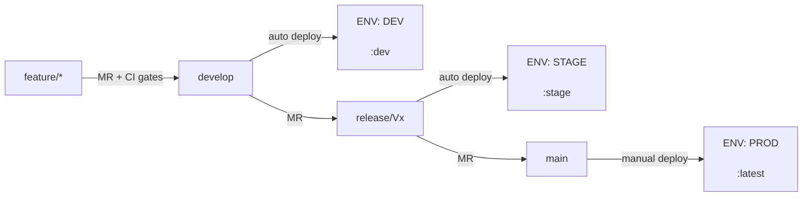
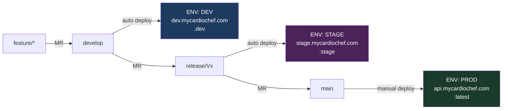

# DevKit — Estrategia de Entornos CI/CD (Global)

> **Skill global**: aplica a todos los microservicios del ecosistema.  
> **Gobernada por**: agente `devkit-devops-orchestrator`  
> **Para variables y URLs concretas de cada microservicio**: consultar su skill de proyecto (ej. `middleware-environments`)

## Purpose
Define the canonical branch→environment strategy, GitLab CI scoped variable taxonomy, promotion flows, and process to generate project-specific environment skills for any microservice in the ecosystem.

## When to use
- Setting up environments for a new microservice for the first time
- Understanding the branch→environment mapping (develop→DEV, release/Vx→STAGE, main→PROD)
- Configuring GitLab CI/CD scoped variables for an existing service
- Generating a project-specific environments skill (`<service>-environments`)

## When NOT to use
- Fetching concrete variable values for a specific microservice → use the project's own skill (e.g. `middleware-environments`)
- Generating a full CI/CD pipeline from scratch → use `devkit-gitlab-cicd`
- Application code implementation → use the relevant stack lifecycle agent

## Inputs
- Service/microservice name
- DEV, STAGE, PROD URLs
- Variable taxonomy (DB credentials, API keys, feature flags)
- GitLab group/project path (for variable scope configuration)

## Steps
See numbered sections below (§1–§9).

## Expected outputs
- Documented branch→environment mapping for the service
- GitLab CI scoped variable configuration
- `.env.local.example`, `.env.stage.example`, `.env.prod.example` stubs
- `scripts/sync_env.sh` and `scripts/sync_gitlab_variables.sh`
- Project-specific environments skill file at `.github/skills/<service>-environments/SKILL.md`

## Validation
See §8 Checklist: Primer Deploy a un Entorno Nuevo.

## Examples
- "Configura los entornos para el microservicio ner-gliner"
- "Genera la skill de entornos del middleware"
- "Qué variables necesito en GitLab para el entorno de staging"

---

## 1. Patrón Canónico Branch → Entorno



| Rama | Entorno | Docker Tag | Deploy | `APP_ENV` |
|---|---|---|---|---|
| `feature/*` | — (solo CI gates) | — | — | — |
| `develop` | **DEV** | `:dev` | Automático post-merge | `dev` |
| `release/Vx` | **STAGE** | `:stage` | Automático post-merge | `stage` |
| `main` | **PROD** | `:latest` | **Manual** (botón GitLab) | `prod` |

### Naming de ramas release
- Patrón: `release/Vx` → `release/V1`, `release/V2`, `release/V3`, …
- Se crean desde `develop` cuando hay contenido validado en DEV listo para stage.
- Cada versión mayor de producto tiene su propia rama `release/Vx`.
- **Regla**: solo se reciben merges desde la rama anterior. Nunca commits directos.

---

## 2. Scopes de Variables GitLab CI/CD

GitLab permite asignar un **scope de entorno** a cada variable. El pipeline lee el valor correcto según dónde se ejecuta.

| GitLab Scope | Aplica a ramas | Propósito |
|---|---|---|
| `*` | Todas | Variables con el mismo valor en todos los entornos (ej. nombres de servicio, config global) |
| `development` | `develop` | Valores específicos de DEV |
| `staging` | `release/V*` | Valores específicos de STAGE |
| `production` | `main` | Valores específicos de PROD |

### Crear una variable con scope en GitLab UI

1. **Settings → CI/CD → Variables → Add variable**
2. Rellenar: **Key**, **Value**, **Environment scope** (el scope), **Masked** (activar para secretos)
3. Repetir por cada scope que necesite valor diferente

### Variables sensibles — regla de seguridad

| Variable | Regla |
|---|---|
| Passwords de DB | Distintos en dev / stage / prod. **Prod con password fuerte** |
| JWT_SECRET / tokens de firma | **Nunca reutilizar entre entornos**. Generar con `openssl rand -base64 64` |
| API Keys externas | Pueden compartirse si el servicio lo permite (ej. dev/stage comparten, prod no) |
| Tunnel tokens | Uno por entorno, generados en el dashboard del proveedor |

---

## 3. Taxonomía de Variables (Categorías Genéricas)

Cada microservicio tendrá sus propias variables, pero todas caen en estas categorías:

| Categoría | Ejemplos típicos | Scope recomendado |
|---|---|---|
| **Runtime / App** | PORT, APP_ENV, LOG_LEVEL, KTOR_DEVELOPMENT | Per-env o `*` |
| **Base de datos** | DB_*_URL, DB_*_USER, DB_*_PASSWORD | Per-env (siempre) |
| **Autenticación JWT** | JWT_SECRET, JWT_*_EXPIRATION | Per-env (siempre) |
| **Auth interna HMAC** | INTERNAL_AUTH_SERVICE_ID, INTERNAL_AUTH_KEY_ID, INTERNAL_AUTH_SECRET | Per-env |
| **Túnel / Proxy** | TUNNEL_TOKEN | Per-env |
| **MCP Server** | MCP_API_KEYS, MCP_SERVER_NAME, MCP_RATE_LIMIT_* | Per-env (keys), `*` (config) |
| **Storage / CDN** | CF_R2_*, R2_*, S3_* | `*` o per-env |
| **APIs externas** | *_API_KEY, *_TOKEN | `*` o per-env |
| **Servicios internos** | *_ENDPOINT | Per-env |
| **Docker networking** | PRIVATE_DOCKER_NETWORK, COMPOSE_PROJECT_NAME | Per-env |

### Valores de runtime por entorno (patrón)

| Variable | LOCAL | DEV | STAGE | PROD |
|---|---|---|---|---|
| `APP_ENV` | `dev` (o vacío) | `dev` | `stage` | `prod` |
| `KTOR_DEVELOPMENT` | `true` | `false` | `false` | `false` |
| `LOG_LEVEL` | `DEBUG` | `DEBUG` | `INFO` | `WARN` |
| `HTTP_TRACE_ENABLED` | `true` | `true` | `true` | `false` |

---

## 4. Reglas GitLab CI (Patterns YAML)

### Build / Test / Review → solo en MR hacia develop
```yaml
rules:
  - if: '$CI_PIPELINE_SOURCE == "merge_request_event" && $CI_MERGE_REQUEST_TARGET_BRANCH_NAME == "develop"'
```

### Docker Build DEV → MR hacia develop + push a develop
```yaml
rules:
  - if: '$CI_PIPELINE_SOURCE == "merge_request_event" && $CI_MERGE_REQUEST_TARGET_BRANCH_NAME == "develop"'
  - if: '$CI_PIPELINE_SOURCE == "push" && $CI_COMMIT_REF_NAME == "develop"'
```

### Docker Build STAGE → MR hacia release/Vx
```yaml
rules:
  - if: '$CI_PIPELINE_SOURCE == "merge_request_event" && $CI_MERGE_REQUEST_TARGET_BRANCH_NAME =~ /^release/'
```

### Docker Build PROD → MR hacia main
```yaml
rules:
  - if: '$CI_PIPELINE_SOURCE == "merge_request_event" && $CI_MERGE_REQUEST_TARGET_BRANCH_NAME == "main"'
```

### Deploy DEV → post-merge en develop
```yaml
rules:
  - if: '$CI_COMMIT_REF_NAME == "develop"'
```

### Deploy STAGE → post-merge en release/Vx
```yaml
rules:
  # Soporta release/V1, release/V2, etc.
  - if: '$CI_COMMIT_REF_NAME =~ /^release/'
```

### Deploy PROD → post-merge en main (SIEMPRE manual)
```yaml
when: manual
rules:
  - if: '$CI_COMMIT_REF_NAME == "main"'
```

---

## 5. Ficheros de Entorno por Repo

Todo microservicio debe tener estos ficheros:

| Fichero | Estado git | Propósito |
|---|---|---|
| `.env.local.example` | **Commitado** | Plantilla local/dev con valores de ejemplo |
| `.env.stage.example` | **Commitado** | Plantilla staging con valores de ejemplo y alertas |
| `.env.prod.example` | **Commitado** | Plantilla prod con instrucciones de generación de secretos |
| `.env.local` | `.gitignore` | Valores reales locales |
| `.env.stage` | `.gitignore` | Valores reales staging |
| `.env.prod` | `.gitignore` | Valores reales producción |

### `.gitignore` mínimo requerido
```
.env
.env.local
.env.stage
.env.prod
```

### Scripts de sincronización recomendados

| Script | Función |
|---|---|
| `scripts/sync_env.sh` | Crea `.env.local` desde `.env.local.example` o sincroniza nuevas variables |
| `scripts/sync_gitlab_variables.sh` | Sube variables de un fichero `.env.*` a GitLab con el scope indicado |

---

## 6. Flujos de Promoción

### Feature → DEV
```
1. git checkout -b feature/us-XX-descripcion
2. [desarrollar + commits]
3. git push -u origin feature/us-XX-descripcion
4. Crear MR: feature/us-XX → develop
5. Pipeline: build → test → code_review → build_docker_image_dev
6. Si ✅ → Merge
7. Pipeline post-merge: deploy_dev (automático)
8. Verificar en <dev-url>/health
```

### DEV → STAGE (nueva release/Vx)
```
1. git checkout develop && git pull
2. git checkout -b release/V2   # versión nueva
3. git push -u origin release/V2
4. Crear MR: develop → release/V2
5. Pipeline: build → test → code_review → build_docker_image_stage
6. Si ✅ → Merge
7. Pipeline post-merge: deploy_stage (automático)
8. Verificar en <stage-url>/health
9. Ejecutar smoke tests manuales
```

### STAGE → PROD
```
1. Crear MR: release/V2 → main
2. Pipeline: build → test → code_review → build_docker_image_prod
3. Si ✅ → Merge (requiere 2 revisores)
4. Pipeline genera imagen :latest
5. ⚠️ Deploy MANUAL: GitLab → Pipelines → job 'deploy_prod' → Play
6. Verificar en <prod-url>/health
7. git tag -a v2.0.0 -m "Release V2" && git push origin v2.0.0
```

> **Regla invariable**: El deploy de PROD es **siempre manual**. Nunca automático.

---

## 7. Pre-check de Variables en Deploy

Antes de cada deploy, el CI verifica que las variables requeridas existen. Si falta alguna, el job falla con un error descriptivo que lista las variables ausentes.

```yaml
.deploy_required_vars_check: &deploy_required_vars_check |
  REQUIRED_VARS="VAR1 VAR2 VAR3 ..."   # definir en la skill de proyecto
  MISSING_VARS=""
  for VAR_NAME in $REQUIRED_VARS; do
    eval "VAR_VALUE=\${$VAR_NAME:-}"
    if [ -z "$VAR_VALUE" ]; then MISSING_VARS="$MISSING_VARS $VAR_NAME"; fi
  done
  if [ -n "$MISSING_VARS" ]; then
    echo "❌ Missing required CI/CD variables:$MISSING_VARS"
    echo "💡 Configure them in GitLab > Settings > CI/CD > Variables with the correct Environment scope."
    exit 1
  fi
  echo "✅ Deploy precheck passed."
```

La lista concreta de `REQUIRED_VARS` se define en la skill de proyecto de cada microservicio.

---

## 8. Checklist: Primer Deploy a un Entorno Nuevo

- [ ] ¿La rama del entorno existe y tiene contenido validado?
- [ ] ¿Están configuradas las variables GitLab con el scope correcto?
  - DB credentials (scope del entorno)
  - Secretos JWT y HMAC (únicos por entorno, `openssl rand -base64 64`)
  - Tunnel Token (del entorno correspondiente)
  - API Keys externas (si aplica)
- [ ] ¿Ha pasado el pipeline completo (build + test + docker)?
- [ ] ¿Ha arrancado el job de deploy (auto o manual)?
- [ ] ¿Responde el endpoint `/health`?
- [ ] ¿Se han ejecutado smoke tests?

---

## 9. Cómo Generar la Skill de Proyecto (Instancia)

Cuando se incorpora un nuevo microservicio o se quiere formalizar el contrato de entornos de uno existente, usar este prompt con el agente `devkit-devops`:

```
Usando la skill global devkit-environments-cicd como base, genera la skill de entornos
específica para el microservicio <nombre>.

Información del proyecto:
- GitLab Project ID: <id>
- Registry: <registry-url>
- Entornos: dev (<dev-url>) / stage (<stage-url>) / prod (<prod-url>)
- Variables requeridas en el precheck de deploy: <lista>
- Variables por categoría:
  - DB: <lista con valores ejemplo>
  - JWT: <lista>
  - HMAC interno: <lista>
  - APIs externas: <lista>
  - Servicios internos (endpoints): <lista>
  - Runtime: <lista>
- Fichero de plantilla ejemplo: .env.local.example (ya existente en el repo)

Nombre de la skill: <microservicio>-environments
Ubicación: .github/skills/<microservicio>-environments/SKILL.md
```

El agente generará:
1. La skill `.github/skills/<microservicio>-environments/SKILL.md`
2. Las plantillas `.env.stage.example` y `.env.prod.example` si no existen
3. Verificará que `.env.stage` y `.env.prod` estén en `.gitignore`

---

## Referencias Globales

- Skill `gitlab-cicd` — Generación/modificación del pipeline completo
- Skill `devkit-ktor-auth-flow` — JWT, Argon2id, auth endpoints
- Agente `devkit-devops` — Gobernador de CI/CD y estrategia de entornos
- [GitLab CI/CD Variables docs](https://docs.gitlab.com/ee/ci/variables/)


# Estrategia de Entornos — CardioChef Middleware

> **Gobernada por**: agente `devkit-devops`  
> **Aplica a**: todos los repositorios del ecosistema mycardiochef  
> **Fuente de verdad local**: este fichero (`.github/skills/devkit-environments-cicd/SKILL.md`)

---

## Visión general



---

## 1. Mapeo Branch → Entorno

| Rama | Entorno | URL | Docker Tag | Deploy | APP_ENV |
|---|---|---|---|---|---|
| `feature/*` | — (solo CI build/test/review) | — | — | — | — |
| `develop` | **DEV** | https://dev.mycardiochef.com | `:dev` | Automático post-merge | `dev` |
| `release/Vx` | **STAGE** | https://stage.mycardiochef.com | `:stage` | Automático post-merge | `stage` |
| `main` | **PROD** | https://api.mycardiochef.com | `:latest` | **Manual** (botón GitLab) | `prod` |

### Naming de ramas release
Las ramas de integración de stage siguen el patrón `release/Vx`:
- `release/V1`, `release/V2`, `release/V3`, …
- Se crean desde `develop` cuando se quiere promocionar al entorno de stage.
- Cada versión mayor de producto corresponde a una rama `release/Vx`.

> **Regla**: Nunca trabajar directamente en `release/Vx` o `main`. Solo se reciben merges desde la rama anterior.

---

## 2. Taxonomía de Variables

### Grupos de variables

| Grupo | Variables | Sensible |
|---|---|---|
| **Base de datos AUTH** | `DB_AUTH_URL`, `DB_AUTH_USER`, `DB_AUTH_PASSWORD` | ✅ |
| **Base de datos PROFILES** | `DB_PROFILES_URL`, `DB_PROFILES_USER`, `DB_PROFILES_PASSWORD` | ✅ |
| **JWT** | `JWT_SECRET`, `JWT_ACCESS_TOKEN_EXPIRATION`, `JWT_REFRESH_TOKEN_EXPIRATION_DAYS` | ✅ |
| **Auth interna (HMAC)** | `INTERNAL_AUTH_SERVICE_ID`, `INTERNAL_AUTH_KEY_ID`, `INTERNAL_AUTH_SECRET`, `INTERNAL_AUTH_ALLOWED_SKEW_SECONDS` | ✅ |
| **MCP Server** | `MCP_API_KEYS`, `MCP_SERVER_NAME`, `MCP_SERVER_VERSION`, `MCP_RATE_LIMIT_MAX_ATTEMPTS`, `MCP_DB_MAX_ROWS`, `MCP_DB_ALLOW_JOINS` | ✅ (keys) |
| **Cloudflare R2** | `CF_R2_ACCOUNT_ID`, `CF_R2_ACCESS_KEY_ID`, `CF_R2_SECRET_ACCESS_KEY`, `R2_BUCKET_NAME`, `R2_PUBLIC_BASE_URL`, `R2_ENDPOINT`, `R2_INGREDIENT_IMAGE_PREFIX`, `R2_INGREDIENT_ICON_PREFIX`, `R2_INGREDIENTS_BASE_PREFIX` | ✅ (keys) |
| **Túnel Cloudflare** | `TUNNEL_TOKEN` | ✅ |
| **APIs externas** | `SPOONACULAR_API_KEY` | ✅ |
| **Runtime / App** | `PORT`, `KTOR_DEVELOPMENT`, `APP_ENV`, `LOG_LEVEL`, `HTTP_TRACE_ENABLED`, `MIDDLEWARE_SERVICE_ID`, `PRIVATE_DOCKER_NETWORK` | ❌ |
| **Servicios internos** | `NER_ENDPOINT`, `OCR_ENDPOINT`, `WEB_SCRAPING_ENDPOINT`, `CARDIOSCORING_ENDPOINT`, `RAG_TRANSFORM_ENDPOINT` | ❌ |
| **Imágenes / Assets** | `INGREDIENT_IMAGE_MAX_DIMENSION`, `INGREDIENT_IMAGE_PNG_COMPRESSION_QUALITY` | ❌ |

---

### Variables por entorno

| Variable | LOCAL | DEV | STAGE | PROD |
|---|---|---|---|---|
| `DB_AUTH_URL` | `jdbc:postgresql://host.docker.internal:5432/cardioauthdb` | URL PostgreSQL DEV | URL PostgreSQL STAGE | URL PostgreSQL PROD |
| `DB_AUTH_USER` | `authappuser` | user-dev | user-stage | user-prod |
| `DB_AUTH_PASSWORD` | (dev password) | (dev secret) | (stage secret) | (prod secret fuerte) |
| `DB_PROFILES_URL` | `jdbc:postgresql://host.docker.internal:5432/cardioprofilesdb` | URL STAGE | URL STAGE | URL PROD |
| `DB_PROFILES_USER` | `profilesappuser` | user-dev | user-stage | user-prod |
| `DB_PROFILES_PASSWORD` | (dev password) | (dev secret) | (stage secret) | (prod secret fuerte) |
| `JWT_SECRET` | `dev-secret-min-32-chars` | secreto-dev | secreto-stage | **secreto PROD aleatorio ≥64 chars** |
| `INTERNAL_AUTH_SECRET` | (dev secret) | (dev secret) | (stage secret) | (prod secret) |
| `TUNNEL_TOKEN` | (dev token) | (dev token) | (stage token) | (prod token) |
| `APP_ENV` | _(vacío o dev)_ | `dev` | `stage` | `prod` |
| `KTOR_DEVELOPMENT` | `true` | `false` | `false` | `false` |
| `LOG_LEVEL` | `DEBUG` | `DEBUG` | `INFO` | `WARN` |
| `HTTP_TRACE_ENABLED` | `true` | `true` | `true` | `false` |
| `MIDDLEWARE_SERVICE_ID` | `cardiochef-middleware` | `cardiochef-middleware` | `cardiochef-middleware` | `cardiochef-middleware` |
| `MCP_API_KEYS` | (dev keys) | (dev keys) | (stage keys) | (prod keys distintas) |
| `CF_R2_*` / `R2_*` | mismo bucket todos los entornos | ← igual | ← igual | ← igual |
| `SPOONACULAR_API_KEY` | (key compartida) | ← igual | ← igual | ← igual |

> **Regla de seguridad**: `JWT_SECRET` y `INTERNAL_AUTH_SECRET` en PROD deben generarse con `openssl rand -base64 64` y nunca reutilizarse de dev/stage.

---

## 3. Scopes de Variables en GitLab CI/CD

GitLab permite asignar variables a un **scope de entorno** concreto. El pipeline lee la variable correcta según el entorno desplegado.

| GitLab Scope | Aplica a | Entorno |
|---|---|---|
| `*` | Todas las ramas | Variables globales (R2, Spoonacular) |
| `development` | Rama `develop` | Variables de DEV |
| `staging` | Rama `release/V*` | Variables de STAGE |
| `production` | Rama `main` | Variables de PROD |

### Cómo crear una variable con scope en GitLab UI

1. Ir a **Settings → CI/CD → Variables** en el proyecto GitLab
2. Clic en **Add variable**
3. Rellenar:
   - **Key**: nombre de la variable (ej. `DB_AUTH_URL`)
   - **Value**: valor para ese entorno
   - **Environment scope**: seleccionar el scope (ej. `development`)
   - **Masked**: activar para secretos (passwords, tokens, keys)
   - **Protected**: activar si solo debe usarse en ramas protegidas
4. Repetir para cada scope que necesite un valor diferente

> Para variables con el mismo valor en todos los entornos, usar scope `*`.

### Cómo sincronizar variables desde .env.local a GitLab (desarrollo)

```bash
export GITLAB_TOKEN=glpat_xxx  # Personal Access Token con scope 'api'

# Subir variables al scope 'development'
scripts/sync_gitlab_variables.sh \
  --project-id 77373249 \
  --env-file .env.local \
  --scope development

# Subir variables al scope 'staging' (desde un .env.stage si existe)
scripts/sync_gitlab_variables.sh \
  --project-id 77373249 \
  --env-file .env.stage \
  --scope staging
```

> ⚠️ El script ignora automáticamente `GITLAB_TOKEN`, `PRIVATE_TOKEN`, `CI_JOB_TOKEN` y `CI_REGISTRY_PASSWORD`.

---

## 4. Setup de Entorno Local

### Prerrequisitos
- Docker Desktop instalado y corriendo
- Acceso a la PostgreSQL del entorno DEV (o local)
- Credenciales de Cloudflare R2
- Cloudflare Tunnel Token del entorno DEV

### Ficheros de plantilla por entorno

| Entorno | Plantilla (commitada) | Fichero activo (en .gitignore) |
|---|---|---|
| Local / DEV | `.env.local.example` | `.env.local` |
| Stage | `.env.stage.example` | `.env.stage` |
| Producción | `.env.prod.example` | `.env.prod` |

### Pasos

```bash
# 1. Clonar / entrar al repo
cd middleware

# 2. Crear .env.local desde la plantilla
scripts/sync_env.sh
# → Crea .env.local si no existe, o sincroniza variables nuevas

# 3. Editar .env.local con los valores reales
# (Ver sección "Variables por entorno" arriba para cada key)
vim .env.local

# 4. Arrancar con Docker Compose
docker compose --env-file .env.local up --build

# 5. Verificar que está vivo
curl http://localhost:8081/health
```

### Crear plantilla de stage o prod por primera vez

```bash
# Stage
cp .env.stage.example .env.stage
vim .env.stage  # rellenar con valores reales de staging

# Prod
cp .env.prod.example .env.prod
vim .env.prod   # rellenar con valores reales de producción
# JWT_SECRET y INTERNAL_AUTH_SECRET deben ser únicos:
# openssl rand -base64 64
```

> **Nota KTOR_DEVELOPMENT**: En local, `KTOR_DEVELOPMENT=true` desactiva Flyway. Para aplicar migraciones, arrancar una vez con `DOCKER_KTOR_DEVELOPMENT=false` (ya es el default en `docker-compose.yml`). Ver sección 4 de `copilot-instructions.md`.

---

## 5. Flujo de Promoción Paso a Paso

### 5.1 Feature → DEV (el flujo normal de desarrollo)

```
1. git checkout -b feature/us-XX-descripcion
2. [desarrollar, commits]
3. git push -u origin feature/us-XX-descripcion
4. Crear MR en GitLab: feature/us-XX → develop
5. Pipeline MR ejecuta: build → test → code_review → build_docker_image_dev
6. Si ✅ → Merge
7. Pipeline post-merge ejecuta: build_docker_image_dev → deploy_dev  (automático)
8. Verificar en https://dev.mycardiochef.com
```

### 5.2 DEV → STAGE (promoción a release/Vx)

```
1. Desde develop (estable, con features validadas en DEV):
   git checkout develop && git pull
   git checkout -b release/V2   # versión nueva
   git push -u origin release/V2

2. Crear MR en GitLab: develop → release/V2
3. Pipeline MR ejecuta: build → test → code_review → build_docker_image_stage
4. Si ✅ → Merge
5. Pipeline post-merge ejecuta: deploy_stage  (automático)
6. Verificar en https://stage.mycardiochef.com
7. Ejecutar smoke tests manuales
```

### 5.3 STAGE → PROD (promoción a main)

```
1. Crear MR en GitLab: release/V2 → main
2. Pipeline MR ejecuta: build → test → code_review → build_docker_image_prod
3. Si ✅ → Merge (requiere 2 revisores — ver devkit-project.config.md)
4. Pipeline genera imagen :latest
5. ⚠️  Deploy MANUAL: ir a GitLab → Pipelines → job 'deploy_prod' → clic "Play"
6. Verificar en https://api.mycardiochef.com
7. Crear tag git de versión:
   git tag -a v2.0.0 -m "Release V2"
   git push origin v2.0.0
```

> **Regla producción**: El deploy de prod es siempre manual. Nunca automático.

---

## 6. Variables Requeridas por el CI (pre-check de deploy)

El CI verifica estas variables antes de cada deploy. Si alguna falta, el job falla con error descriptivo:

```
INTERNAL_AUTH_SERVICE_ID
INTERNAL_AUTH_KEY_ID
INTERNAL_AUTH_SECRET
DB_AUTH_URL
DB_AUTH_USER
DB_AUTH_PASSWORD
DB_PROFILES_URL
DB_PROFILES_USER
DB_PROFILES_PASSWORD
TUNNEL_TOKEN
```

Estas variables **deben existir** en GitLab con el scope correcto (`development` / `staging` / `production`) antes de ejecutar el primer deploy al entorno correspondiente.

---

## 7. Docker Image Tagging Strategy

| Evento | Tag publicado | Cuándo |
|---|---|---|
| MR hacia `develop` | `:dev` (preview) | En la MR, antes del merge |
| Merge a `develop` | `:dev` | Post-merge, antes del deploy DEV |
| MR hacia `release/Vx` | `:stage` (preview) | En la MR, antes del merge |
| Merge a `release/Vx` | `:stage` | Post-merge, antes del deploy STAGE |
| MR hacia `main` | `:latest` (preview) | En la MR, antes del merge |
| Merge a `main` | `:latest` | Post-merge (deploy manual) |

> La imagen CI runner (`ci-builder:latest`) se construye solo cuando cambia `Dockerfile.ci`. Ver `docs/architecture/CI-CD.md`.

---

## 8. Reglas del Pipeline (`.gitlab-ci.yml` patterns)

### Build / Test / Review (solo en MR hacia develop)
```yaml
rules:
  - if: '$CI_PIPELINE_SOURCE == "merge_request_event" && $CI_MERGE_REQUEST_TARGET_BRANCH_NAME == "develop"'
```

### Docker Build STAGE (MR hacia release/Vx)
```yaml
rules:
  - if: '$CI_PIPELINE_SOURCE == "merge_request_event" && $CI_MERGE_REQUEST_TARGET_BRANCH_NAME =~ /^release/'
```

### Docker Build PROD (MR hacia main)
```yaml
rules:
  - if: '$CI_PIPELINE_SOURCE == "merge_request_event" && $CI_MERGE_REQUEST_TARGET_BRANCH_NAME == "main"'
```

### Deploy DEV (post-merge en develop)
```yaml
rules:
  - if: '$CI_COMMIT_REF_NAME == "develop"'
```

### Deploy STAGE (post-merge en release/Vx)
```yaml
rules:
  - if: '$CI_COMMIT_REF_NAME =~ /^release/'
```

### Deploy PROD (post-merge en main — manual)
```yaml
rules:
  - if: '$CI_COMMIT_REF_NAME == "main"'
when: manual
```

---

## 9. Checklist: Crear un Nuevo Entorno Stage (release/Vx)

- [ ] ¿Develop está estable y validado en DEV?
- [ ] ¿Existe la rama `release/Vx` creada desde develop?
- [ ] ¿Están configuradas las variables GitLab con scope `staging`?
  - `DB_AUTH_URL`, `DB_AUTH_USER`, `DB_AUTH_PASSWORD` (staging)
  - `DB_PROFILES_URL`, `DB_PROFILES_USER`, `DB_PROFILES_PASSWORD` (staging)
  - `JWT_SECRET` (staging — generado con `openssl rand -base64 64`)
  - `INTERNAL_AUTH_SECRET` (staging)
  - `TUNNEL_TOKEN` (staging — token del túnel Cloudflare de stage)
  - `MCP_API_KEYS` (staging)
- [ ] ¿Se ha creado la MR develop → release/Vx en GitLab?
- [ ] ¿Ha pasado el pipeline de la MR (build + test + docker)?
- [ ] ¿Se ha hecho merge?
- [ ] ¿Ha arrancado `deploy_stage` automáticamente?
- [ ] ¿Responde `https://stage.mycardiochef.com/health`?
- [ ] ¿Se han ejecutado smoke tests manuales?

---

## 10. Checklist: Primera Configuración de Variables GitLab

Ejecutar una sola vez por proyecto. Requiere `GITLAB_TOKEN` con scope `api`.

```bash
export GITLAB_TOKEN=glpat_xxx

# 1. Variables DEV (desde .env.local ya relleno)
scripts/sync_gitlab_variables.sh \
  --project-id 77373249 \
  --env-file .env.local \
  --scope development \
  --masked false \
  --protected false

# 2. Variables STAGE (crear .env.stage con valores de stage)
cp .env.local.example .env.stage
# → Editar .env.stage con los valores reales de staging
scripts/sync_gitlab_variables.sh \
  --project-id 77373249 \
  --env-file .env.stage \
  --scope staging \
  --masked false \
  --protected false

# 3. Variables PROD (crear .env.prod con valores de producción)
cp .env.local.example .env.prod
# → Editar .env.prod con los valores reales de producción
# → JWT_SECRET y INTERNAL_AUTH_SECRET deben ser únicos y fuertes:
#    openssl rand -base64 64
scripts/sync_gitlab_variables.sh \
  --project-id 77373249 \
  --env-file .env.prod \
  --scope production \
  --masked false \
  --protected true

# 4. Verificar en GitLab UI:
#    Settings → CI/CD → Variables
#    Cada variable sensible debe tener "Masked" activado manualmente en UI
```

> ⚠️ Los ficheros `.env.stage` y `.env.prod` **NUNCA se commitean** (están en `.gitignore`).

---

## 11. Gobernanza y Alcance Multi-Repo

### Agente gobernador: `devkit-devops`

Esta skill está bajo la gobernanza del agente `devkit-devops`. Cualquier cambio en:
- Estrategia de ramas o naming de releases
- Scopes de variables o nuevas variables requeridas
- Flujo de promoción entre entornos
- Reglas del pipeline

…debe pasar por review del agente `devkit-devops` antes de aplicarse.

### Alcance multi-repositorio

Esta estrategia aplica a **todos los repositorios del ecosistema mycardiochef**:

| Repositorio | Aplica | Notas |
|---|---|---|
| `middleware` | ✅ | Fuente de verdad actual de la skill |
| `ocr-foto` | ✅ | Misma estrategia branch/entorno |
| `web-scraping` | ✅ | Misma estrategia branch/entorno |
| Futuros microservicios | ✅ | Adoptar esta estrategia desde el inicio |

### Cómo promover esta skill a global (devkit)

Si se quiere que esta skill sea accesible desde todos los repos sin copiarla:

```
# Opción A: Copiar a ~/.copilot/skills/ en cada máquina de desarrollo
cp -r .github/skills/devkit-environments-cicd ~/.copilot/skills/

# Opción B: Crear un repo devtools compartido e incluirlo como submodule
# (ver agente devkit-devops para el flujo completo)
```

---

## Referencias

- [`.gitlab-ci.yml`](.gitlab-ci.yml) — Pipeline completo
- [`.env.local.example`](.env.local.example) — Plantilla variables locales/dev
- [`.env.stage.example`](.env.stage.example) — Plantilla variables staging
- [`.env.prod.example`](.env.prod.example) — Plantilla variables producción
- [`scripts/sync_env.sh`](scripts/sync_env.sh) — Sincroniza .env.local desde example
- [`scripts/sync_gitlab_variables.sh`](scripts/sync_gitlab_variables.sh) — Sube variables a GitLab
- [`docs/architecture/CI-CD.md`](docs/architecture/CI-CD.md) — Documentación del pipeline
- [`docs/guides/SERVICE_TO_SERVICE_SIGNING.md`](docs/guides/SERVICE_TO_SERVICE_SIGNING.md) — Auth HMAC interna
- Skill `devkit-ktor-auth-flow` — JWT, Argon2id, auth endpoints
- Skill `gitlab-cicd` — Generación/modificación del pipeline
- Agente `devkit-devops` — Gobernador de CI/CD y estrategia de entornos
