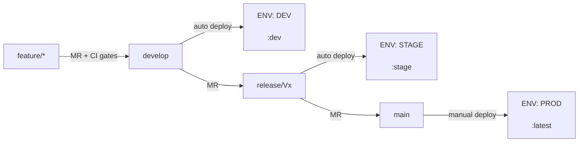

# DevKit — Estrategia de Entornos CI/CD (Global)

> **Skill global**: aplica a todos los microservicios del ecosistema.  
> **Gobernada por**: agente `devkit-devops-orchestrator`  
> **Para variables y URLs concretas de cada microservicio**: consultar su skill de proyecto (ej. `middleware-environments`)

## Purpose
Define the canonical branch→environment strategy, GitLab CI scoped variable taxonomy, promotion flows, and process to generate project-specific environment skills for any microservice in the ecosystem.

## When to use
- Setting up environments for a new microservice for the first time
- Understanding the branch→environment mapping (develop→DEV, release/Vx→STAGE, main→PROD)
- Configuring GitLab CI/CD scoped variables for an existing service
- Generating a project-specific environments skill (`<service>-environments`)

## When NOT to use
- Fetching concrete variable values for a specific microservice → use the project's own skill (e.g. `middleware-environments`)
- Generating a full CI/CD pipeline from scratch → use `devkit-gitlab-cicd`
- Application code implementation → use the relevant stack lifecycle agent

## Inputs
- Service/microservice name
- DEV, STAGE, PROD URLs
- Variable taxonomy (DB credentials, API keys, feature flags)
- GitLab group/project path (for variable scope configuration)

## Steps
See numbered sections below (§1–§11).

## Expected outputs
- Documented branch→environment mapping for the service
- GitLab CI scoped variable configuration
- `.env.local.example`, `.env.stage.example`, `.env.prod.example` stubs
- `scripts/sync_env.sh` and `scripts/sync_gitlab_variables.sh`
- Project-specific environments skill file at `.github/skills/<service>-environments/SKILL.md`

## Validation
See §8 Checklist: Primer Deploy a un Entorno Nuevo.

## Examples
- "Configura los entornos para el microservicio ner-gliner"
- "Genera la skill de entornos del middleware"
- "Qué variables necesito en GitLab para el entorno de staging"

---

## 1. Patrón Canónico Branch → Entorno



| Rama | Entorno | Docker Tag | Deploy | `APP_ENV` |
|---|---|---|---|---|
| `feature/*` | — (solo CI gates) | — | — | — |
| `develop` | **DEV** | `:dev` | Automático post-merge | `dev` |
| `release/Vx` | **STAGE** | `:stage` | Automático post-merge | `stage` |
| `main` | **PROD** | `:latest` | **Manual** (botón GitLab) | `prod` |

### Naming de ramas release
- Patrón: `release/Vx` → `release/V1`, `release/V2`, `release/V3`, …
- Se crean desde `develop` cuando hay contenido validado en DEV listo para stage.
- Cada versión mayor de producto tiene su propia rama `release/Vx`.
- **Regla**: solo se reciben merges desde la rama anterior. Nunca commits directos.

---

## 2. Scopes de Variables GitLab CI/CD

GitLab permite asignar un **scope de entorno** a cada variable. El pipeline lee el valor correcto según dónde se ejecuta.

| GitLab Scope | Aplica a ramas | Propósito |
|---|---|---|
| `*` | Todas | Variables con el mismo valor en todos los entornos (ej. nombres de servicio, config global) |
| `development` | `develop` | Valores específicos de DEV |
| `staging` | `release/V*` | Valores específicos de STAGE |
| `production` | `main` | Valores específicos de PROD |

### Crear una variable con scope en GitLab UI

1. **Settings → CI/CD → Variables → Add variable**
2. Rellenar: **Key**, **Value**, **Environment scope** (el scope), **Masked** (activar para secretos)
3. Repetir por cada scope que necesite valor diferente

### Variables sensibles — regla de seguridad

| Variable | Regla |
|---|---|
| Passwords de DB | Distintos en dev / stage / prod. **Prod con password fuerte** |
| JWT_SECRET / tokens de firma | **Nunca reutilizar entre entornos**. Generar con `openssl rand -base64 64` |
| API Keys externas | Pueden compartirse si el servicio lo permite (ej. dev/stage comparten, prod no) |
| Tunnel tokens | Uno por entorno, generados en el dashboard del proveedor |

---

## 3. Taxonomía de Variables (Categorías Genéricas)

Cada microservicio tendrá sus propias variables, pero todas caen en estas categorías:

| Categoría | Ejemplos típicos | Scope recomendado |
|---|---|---|
| **Runtime / App** | PORT, APP_ENV, LOG_LEVEL, KTOR_DEVELOPMENT | Per-env o `*` |
| **Base de datos** | DB_*_URL, DB_*_USER, DB_*_PASSWORD | Per-env (siempre) |
| **Autenticación JWT** | JWT_SECRET, JWT_*_EXPIRATION | Per-env (siempre) |
| **Auth interna HMAC** | INTERNAL_AUTH_SERVICE_ID, INTERNAL_AUTH_KEY_ID, INTERNAL_AUTH_SECRET | Per-env |
| **Túnel / Proxy** | TUNNEL_TOKEN | Per-env |
| **MCP Server** | MCP_API_KEYS, MCP_SERVER_NAME, MCP_RATE_LIMIT_* | Per-env (keys), `*` (config) |
| **Storage / CDN** | CF_R2_*, R2_*, S3_* | `*` o per-env |
| **APIs externas** | *_API_KEY, *_TOKEN | `*` o per-env |
| **Servicios internos** | *_ENDPOINT | Per-env |
| **Docker networking** | PRIVATE_DOCKER_NETWORK, COMPOSE_PROJECT_NAME | Per-env |

### Valores de runtime por entorno (patrón)

| Variable | LOCAL | DEV | STAGE | PROD |
|---|---|---|---|---|
| `APP_ENV` | `dev` (o vacío) | `dev` | `stage` | `prod` |
| `KTOR_DEVELOPMENT` | `true` | `false` | `false` | `false` |
| `LOG_LEVEL` | `DEBUG` | `DEBUG` | `INFO` | `WARN` |
| `HTTP_TRACE_ENABLED` | `true` | `true` | `true` | `false` |

---

## 4. Reglas GitLab CI (Patterns YAML)

### Build / Test / Review → solo en MR hacia develop
```yaml
rules:
  - if: '$CI_PIPELINE_SOURCE == "merge_request_event" && $CI_MERGE_REQUEST_TARGET_BRANCH_NAME == "develop"'
```

### Docker Build DEV → MR hacia develop + push a develop
```yaml
rules:
  - if: '$CI_PIPELINE_SOURCE == "merge_request_event" && $CI_MERGE_REQUEST_TARGET_BRANCH_NAME == "develop"'
  - if: '$CI_PIPELINE_SOURCE == "push" && $CI_COMMIT_REF_NAME == "develop"'
```

### Docker Build STAGE → MR hacia release/Vx
```yaml
rules:
  - if: '$CI_PIPELINE_SOURCE == "merge_request_event" && $CI_MERGE_REQUEST_TARGET_BRANCH_NAME =~ /^release/'
```

### Docker Build PROD → MR hacia main
```yaml
rules:
  - if: '$CI_PIPELINE_SOURCE == "merge_request_event" && $CI_MERGE_REQUEST_TARGET_BRANCH_NAME == "main"'
```

### Deploy DEV → post-merge en develop
```yaml
rules:
  - if: '$CI_COMMIT_REF_NAME == "develop"'
```

### Deploy STAGE → post-merge en release/Vx
```yaml
rules:
  # Soporta release/V1, release/V2, etc.
  - if: '$CI_COMMIT_REF_NAME =~ /^release/'
```

### Deploy PROD → post-merge en main (SIEMPRE manual)
```yaml
when: manual
rules:
  - if: '$CI_COMMIT_REF_NAME == "main"'
```

---

## 5. Ficheros de Entorno por Repo

Todo microservicio debe tener estos ficheros:

| Fichero | Estado git | Propósito |
|---|---|---|
| `.env.local.example` | **Commitado** | Plantilla local/dev con valores de ejemplo |
| `.env.stage.example` | **Commitado** | Plantilla staging con valores de ejemplo y alertas |
| `.env.prod.example` | **Commitado** | Plantilla prod con instrucciones de generación de secretos |
| `.env.local` | `.gitignore` | Valores reales locales |
| `.env.stage` | `.gitignore` | Valores reales staging |
| `.env.prod` | `.gitignore` | Valores reales producción |

### `.gitignore` mínimo requerido
```
.env
.env.local
.env.stage
.env.prod
```

### Scripts de sincronización recomendados

| Script | Función |
|---|---|
| `scripts/sync_env.sh` | Crea `.env.local` desde `.env.local.example` o sincroniza nuevas variables |
| `scripts/sync_gitlab_variables.sh` | Sube variables de un fichero `.env.*` a GitLab con el scope indicado |

---

## 6. Flujos de Promoción

### Feature → DEV
```
1. git checkout -b feature/us-XX-descripcion
2. [desarrollar + commits]
3. git push -u origin feature/us-XX-descripcion
4. Crear MR: feature/us-XX → develop
5. Pipeline: build → test → code_review → build_docker_image_dev
6. Si ✅ → Merge
7. Pipeline post-merge: deploy_dev (automático)
8. Verificar en <dev-url>/health
```

### DEV → STAGE (nueva release/Vx)
```
1. git checkout develop && git pull
2. git checkout -b release/V2   # versión nueva
3. git push -u origin release/V2
4. Crear MR: develop → release/V2
5. Pipeline: build → test → code_review → build_docker_image_stage
6. Si ✅ → Merge
7. Pipeline post-merge: deploy_stage (automático)
8. Verificar en <stage-url>/health
9. Ejecutar smoke tests manuales
```

### STAGE → PROD
```
1. Crear MR: release/V2 → main
2. Pipeline: build → test → code_review → build_docker_image_prod
3. Si ✅ → Merge (requiere 2 revisores)
4. Pipeline genera imagen :latest
5. ⚠️ Deploy MANUAL: GitLab → Pipelines → job 'deploy_prod' → Play
6. Verificar en <prod-url>/health
7. git tag -a v2.0.0 -m "Release V2" && git push origin v2.0.0
```

> **Regla invariable**: El deploy de PROD es **siempre manual**. Nunca automático.

---

## 7. Pre-check de Variables en Deploy

Antes de cada deploy, el CI verifica que las variables requeridas existen. Si falta alguna, el job falla con un error descriptivo que lista las variables ausentes.

```yaml
.deploy_required_vars_check: &deploy_required_vars_check |
  REQUIRED_VARS="VAR1 VAR2 VAR3 ..."   # definir en la skill de proyecto
  MISSING_VARS=""
  for VAR_NAME in $REQUIRED_VARS; do
    eval "VAR_VALUE=\${$VAR_NAME:-}"
    if [ -z "$VAR_VALUE" ]; then MISSING_VARS="$MISSING_VARS $VAR_NAME"; fi
  done
  if [ -n "$MISSING_VARS" ]; then
    echo "❌ Missing required CI/CD variables:$MISSING_VARS"
    echo "💡 Configure them in GitLab > Settings > CI/CD > Variables with the correct Environment scope."
    exit 1
  fi
  echo "✅ Deploy precheck passed."
```

La lista concreta de `REQUIRED_VARS` se define en la skill de proyecto de cada microservicio.

---

## 8. Checklist: Primer Deploy a un Entorno Nuevo

- [ ] ¿La rama del entorno existe y tiene contenido validado?
- [ ] ¿Están configuradas las variables GitLab con el scope correcto?
  - DB credentials (scope del entorno)
  - Secretos JWT y HMAC (únicos por entorno, `openssl rand -base64 64`)
  - Tunnel Token (del entorno correspondiente)
  - API Keys externas (si aplica)
- [ ] ¿Ha pasado el pipeline completo (build + test + docker)?
- [ ] ¿Ha arrancado el job de deploy (auto o manual)?
- [ ] ¿Responde el endpoint `/health`?
- [ ] ¿Se han ejecutado smoke tests?

---

## 9. Runbook: Setup Completo de un Entorno Stage (Día 0)

Este es el procedimiento exacto para activar el entorno stage en un microservicio. Ejecutar en orden.

### Paso 1 — Generar los secretos

```bash
echo "JWT_SECRET=$(openssl rand -base64 64 | tr -d '\n')"
echo "INTERNAL_AUTH_SECRET=$(openssl rand -base64 48 | tr -d '\n')"
echo "DB_STAGE_PASSWORD=$(openssl rand -base64 24 | tr -d '\n')"
echo "MCP_KEY_1=$(openssl rand -base64 48 | tr -d '\n')"
echo "MCP_KEY_2=$(openssl rand -base64 48 | tr -d '\n')"
```

Guardar los valores — se usarán en los pasos siguientes.

### Paso 2 — Crear las bases de datos stage

Ejecutar el script de setup de DB del microservicio (ej. `db/scripts/setup_stage.sh`) contra el contenedor Docker del PostgreSQL compartido:

```bash
export DB_STAGE_PASSWORD='<generado en paso 1>'
bash db/scripts/setup_stage.sh
# usa docker exec internamente contra el contenedor postgres configurado
```

### Paso 3 — Crear .env.stage

```bash
cp .env.stage.example .env.stage
```

Rellenar con:
- URLs de BD con sufijo `_stage`
- `JWT_SECRET` y `INTERNAL_AUTH_SECRET` generados en paso 1
- `TUNNEL_TOKEN` del entorno stage (dashboard del proveedor)
- `MCP_API_KEYS`: `KEY_1,KEY_2` generados en paso 1
- Variables globales (`CF_R2_*`, APIs externas): copiar de `.env.local`
- `PORT`: diferente a dev (ej. `8082`) para coexistir en el mismo servidor

### Paso 4 — Sincronizar variables a GitLab

```bash
export GITLAB_TOKEN=glpat_xxx  # token con scope 'api'
scripts/sync_gitlab_variables.sh \
  --project-id <PROJECT_ID> \
  --env-file .env.stage \
  --scope staging
```

Verificar en GitLab UI: **Settings → CI/CD → Variables** — activar **Masked** en las variables sensibles (`*_PASSWORD`, `JWT_SECRET`, `INTERNAL_AUTH_SECRET`, `TUNNEL_TOKEN`, `MCP_API_KEYS`).

### Paso 5 — Crear la rama release/V1 y hacer push

```bash
git checkout develop && git pull
git checkout -b release/V1
git push -u origin release/V1
```

### Paso 6 — Crear la MR en GitLab

En GitLab → **Merge Requests → New MR**:
- Source: `develop`
- Target: `release/V1`

El pipeline ejecuta automáticamente: `build → test → code_review → build_docker_image_stage`

### Paso 7 — Merge y verificación del deploy

Cuando el pipeline pase:
1. Hacer merge
2. El job `deploy_stage` se ejecuta automáticamente
3. Verificar: `curl https://staging.<proyecto>.com/health`

> **Regla invariable**: El deploy de PROD es **siempre manual**. Nunca automático.

---

## 10. Cómo Generar la Skill de Proyecto (Instancia)

Cuando se incorpora un nuevo microservicio o se quiere formalizar el contrato de entornos de uno existente, usar este prompt con el agente `devkit-devops-orchestrator`:

```
Usando la skill global devkit-environments-cicd como base, genera la skill de entornos
específica para el microservicio <nombre>.

Información del proyecto:
- GitLab Project ID: <id>
- Registry: <registry-url>
- Entornos: dev (<dev-url>) / stage (<stage-url>) / prod (<prod-url>)
- Variables requeridas en el precheck de deploy: <lista>
- Variables por categoría:
  - DB: <lista con valores ejemplo>
  - JWT: <lista>
  - HMAC interno: <lista>
  - APIs externas: <lista>
  - Servicios internos (endpoints): <lista>
  - Runtime: <lista>
- Fichero de plantilla ejemplo: .env.local.example (ya existente en el repo)

Nombre de la skill: <microservicio>-environments
Ubicación: .github/skills/<microservicio>-environments/SKILL.md
```

El agente generará:
1. La skill `.github/skills/<microservicio>-environments/SKILL.md`
2. Las plantillas `.env.stage.example` y `.env.prod.example` si no existen
3. Verificará que `.env.stage` y `.env.prod` estén en `.gitignore`

---

## 11. Gobernanza y Alcance Multi-Repo

### Agente gobernador: `devkit-devops-orchestrator`

Cualquier cambio en estrategia de ramas, scopes de variables, flujo de promoción o reglas del pipeline debe pasar por review del agente `devkit-devops-orchestrator`.

### Alcance multi-repositorio

Esta estrategia aplica a todos los microservicios del ecosistema. Cada microservicio instancia esta skill con su propia `<microservicio>-environments` skill.

### Cómo actualizar esta skill en proyectos consumidores

```bash
# Opción A: re-ejecutar setup-project para actualizar los symlinks
bash $COPILOT_DEVKIT_HOME/setup-project.sh --kotlin  # o la tech correspondiente

# Opción B: ejecutar install para actualizar los globales
bash $COPILOT_DEVKIT_HOME/install.sh
```

---

## Referencias Globales

- Skill `devkit-gitlab-cicd` — Generación/modificación del pipeline completo
- Skill `devkit-github-actions-cicd` — Pipelines GitHub Actions
- Skill `devkit-azure-pipelines-cicd` — Pipelines Azure DevOps
- Agente `devkit-devops-orchestrator` — Gobernador de CI/CD y estrategia de entornos
- [GitLab CI/CD Variables docs](https://docs.gitlab.com/ee/ci/variables/)
