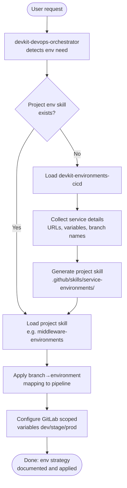

# devkit-environments-cicd — Skill Overview

## Workflow

## Description

| Step | Description |
|---|---|
| Detect env need | Orchestrator checks whether any environment-related request is made |
| Check project skill | Search workspace for `<service>-environments` skill |
| Load global skill | Use `devkit-environments-cicd` as the canonical reference |
| Collect details | Service name, URLs per environment, variable taxonomy |
| Generate project skill | Produce a service-scoped environments skill for future use |
| Apply to pipeline | Inject branch rules and variable scopes into CI/CD pipeline |
