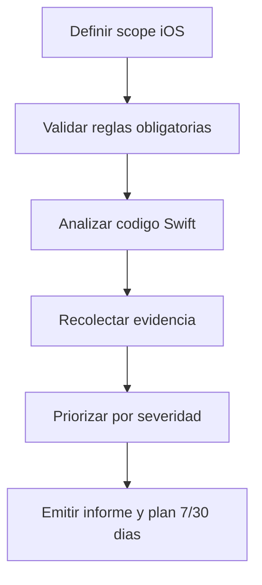

# devkit-ios-clean-architecture-quality - Overview

## Purpose

Auditoria de calidad de arquitectura iOS/Swift con reglas por severidad y evidencia verificable.

## Workflow

## Rule files

- `references/ios-rules-critical.md`
- `references/ios-rules-high.md`
- `references/ios-rules-medium.md`
- `references/ios-rules-low.md`
