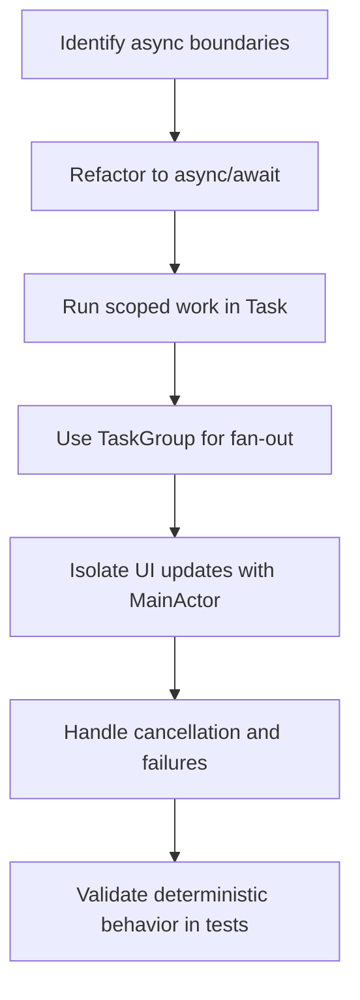

# iOS Swift Concurrency Overview

Official references:
- https://developer.apple.com/documentation/swift/concurrency

## Workflow

## Notes
- Keep actor isolation explicit.
- Use checked continuations to bridge legacy callbacks only when required.
