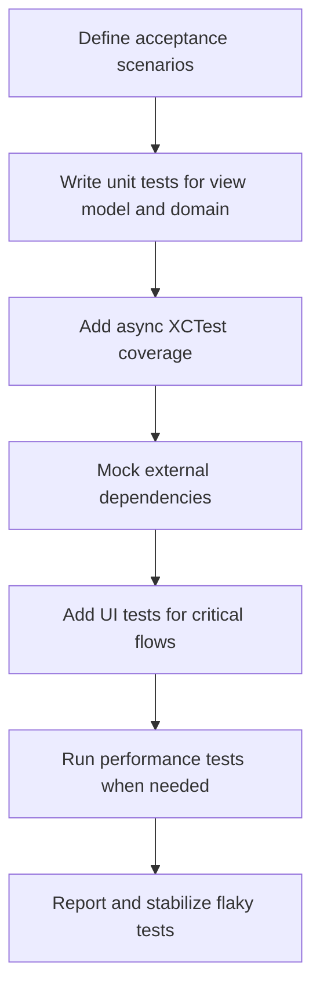

# SwiftUI Testing XCTest Overview

Official references:
- https://developer.apple.com/documentation/xctest

## Workflow

## Notes
- Favor deterministic tests over integration-heavy tests.
- Keep UI tests focused on high-value user journeys.
