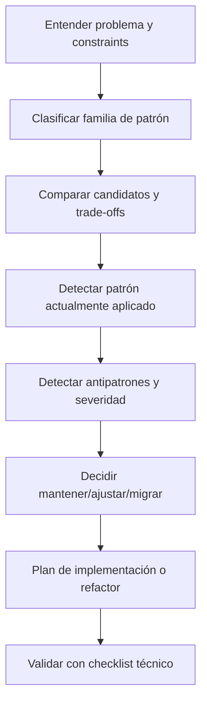

# iOS Patterns Overview

Origen principal de conocimiento:
- /Users/manelcc/Documents/BANKINTER/apps-ios/appmovil-nbo-ios/.github/skills/ios-patterns

## Workflow

## Usage outcomes
- Patrón aplicable recomendado.
- Patrón actual detectado en código.
- Antipatrones detectados con remediación.
