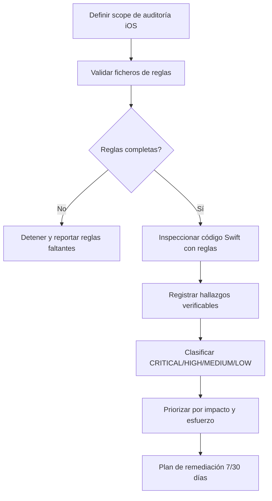

# iOS Quality Overview

Source lineage:
- /Users/manelcc/Library/CloudStorage/OneDrive-SopraSteria/mac/KMP_APPS/PRUEBA-TECNICA/ANDROID/.github/skills/ios-quality-skill/
- /Users/manelcc/Library/CloudStorage/OneDrive-SopraSteria/mac/KMP_APPS/PRUEBA-TECNICA/ANDROID/.github/ios-quality-rules/

## Workflow

## Severity reference
- **CRITICAL**: bloquea merge. Seguridad, fugas de memoria estructurales, arquitectura rota.
- **HIGH**: corregir antes de release. Mutaciones UI fuera de MainActor, force unwrap en prod.
- **MEDIUM**: corregir en sprint actual. Massive ViewModel, NavigationView en código nuevo.
- **LOW**: corregir cuando sea posible. Inconsistencias de estilo, cobertura baja.

## Rules files
- ios-rules-critical.md
- ios-rules-high.md
- ios-rules-medium.md
- ios-rules-low.md
