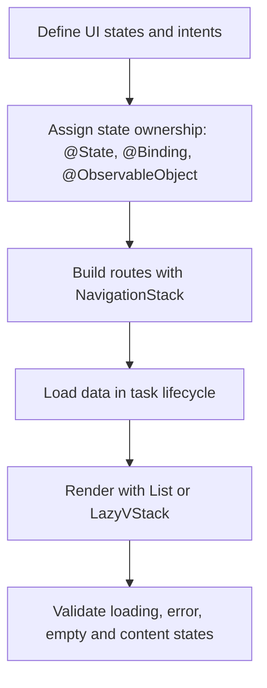

# SwiftUI Patterns Overview

Official references:
- https://developer.apple.com/documentation/swiftui
- https://developer.apple.com/documentation/swift/concurrency

## Workflow

## Notes
- Prefer explicit state boundaries to avoid side effects.
- Use NavigationStack as default for SwiftUI navigation.
