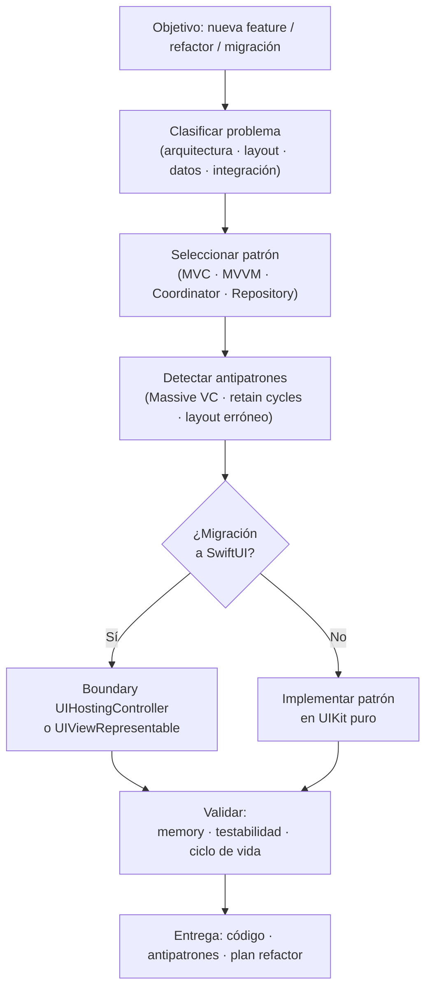

# UIKit Patterns — Overview

## Workflow

## Patrones cubiertos

| Categoría | Patrón | Uso principal |
|---|---|---|
| Arquitectura | MVC | App sencilla, pantallas aisladas |
| Arquitectura | MVVM | Lógica compleja, testabilidad |
| Arquitectura | Coordinator | Navegación desacoplada |
| UI | UITableView DataSource separado | Separación responsabilidades |
| UI | Auto Layout programático | Sin Storyboard, control total |
| Datos | Repository + Service | Abstracción de red y persistencia |
| Datos | CoreData NSFetchedResultsController | Listas reactivas con persistencia |
| Integración | UIHostingController | UIKit → SwiftUI |
| Integración | UIViewRepresentable | SwiftUI → UIKit |

## Antipatrones detectables

- **Massive ViewController** (CRITICAL) — lógica de negocio en `viewDidLoad`
- **Retain cycle** (CRITICAL) — closure sin `[weak self]`
- **Delegate fuerte** (HIGH) — `var delegate: MyDelegate?` sin `weak`
- **Layout en viewWillAppear** (MEDIUM) — debe ser en `viewDidLayoutSubviews`
- **Magic strings en segues** (LOW) — usar constantes o Coordinator
