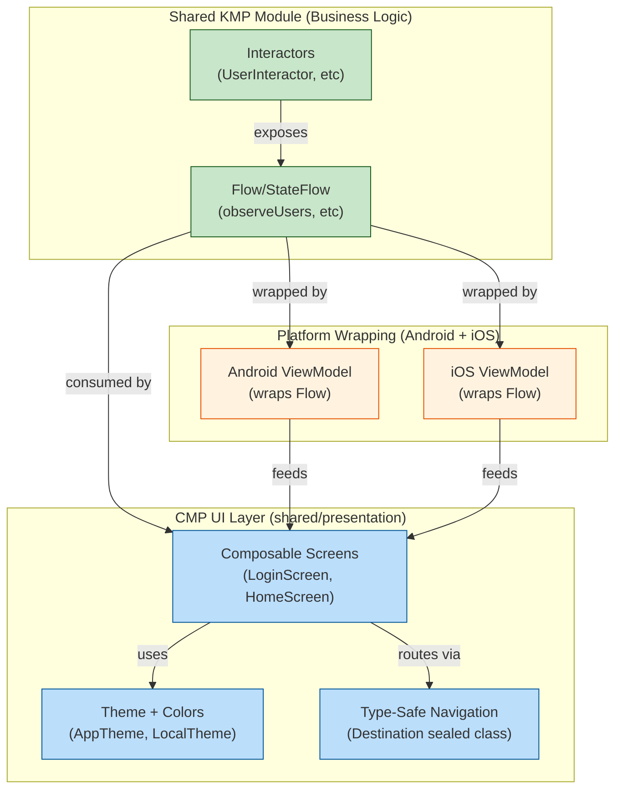
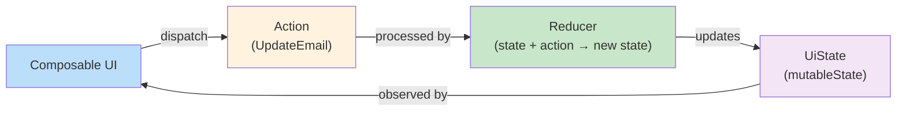
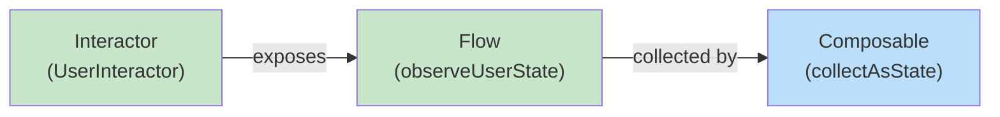
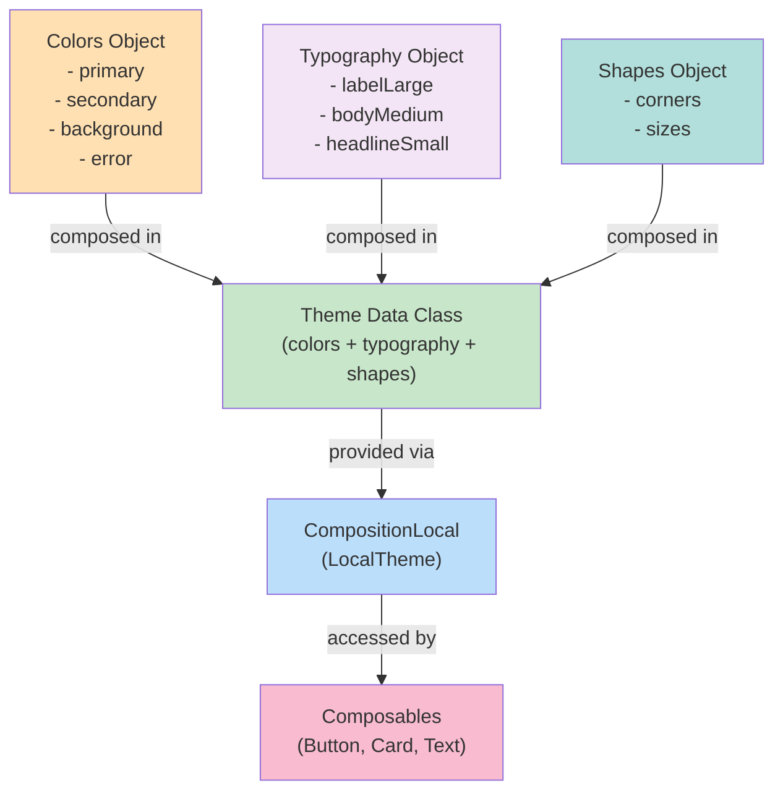
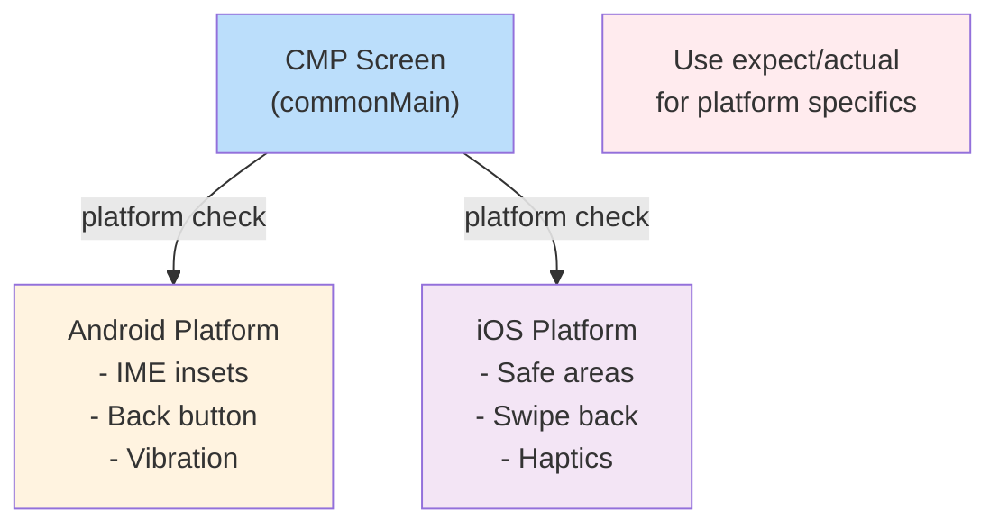
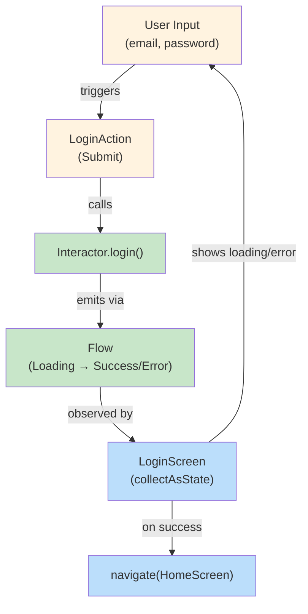

# CMP UI Architecture Overview

## Compose Multiplatform Layer Architecture



## State Management Options

### Option 1: Local Composable State (MVI-inspired)



### Option 2: Interactor + Flow (Reactive)



## Navigation Type-Safe Pattern

```mermaid
graph TD
    App["App Composable"]
    NavController["NavController<br/>(currentDestination StateFlow)"]
    Destination["sealed class Destination<br/>- LoginScreen<br/>- HomeScreen<br/>- UserDetailScreen(userId)"]
    Screens["Screens<br/>(when(currentDest) {...})"]
    
    App -->|observes| NavController
    NavController -->|manages| Destination
    Destination -->|routed to| Screens
    Screens -->|navigate(dest)| NavController
    
    classDef control fill:#fff3e0
    classDef model fill:#f3e5f5
    classDef ui fill:#bbdefb
    
    class App,NavController control
    class Destination model
    class Screens ui
```

## Theming Strategy (Light/Dark Mode)



## Performance: Avoiding Recomposition

```mermaid
graph LR
    Data["Data Changes"]
    Key["LazyList key = { item.id }"]
    Remember["remember(dependency)"]
    Memoization["@Composable cached"]
    
    Data -->|with key()| Key
    Key -->|prevents recomp| Memoization
    
    Data -->|with remember()| Remember
    Remember -->|skips calc| Memoization
    
    style Data fill:#ffcdd2
    style Key fill:#c8e6c9
    style Remember fill:#c8e6c9
    style Memoization fill:#bbdefb
```

## Platform-Specific Handling



## Complete Example: Login Flow



## Checklist: Healthy CMP Architecture

- [ ] No platform-specific code in commonMain composables
- [ ] State flows from Interactors (business logic) → Composables (UI)
- [ ] Navigation is type-safe (sealed class Destination)
- [ ] Theming via CompositionLocal (no hardcoded colors)
- [ ] LazyList uses `key { item.id }` to optimize recomposition
- [ ] Heavy computations memoized with `remember()`
- [ ] No memory leaks (DisposableEffect cleanup)
- [ ] Platform-specific UI (IME, safe areas) via expect/actual
- [ ] Light/Dark mode theme switching works seamlessly
- [ ] Screenshot tests cover major screens
