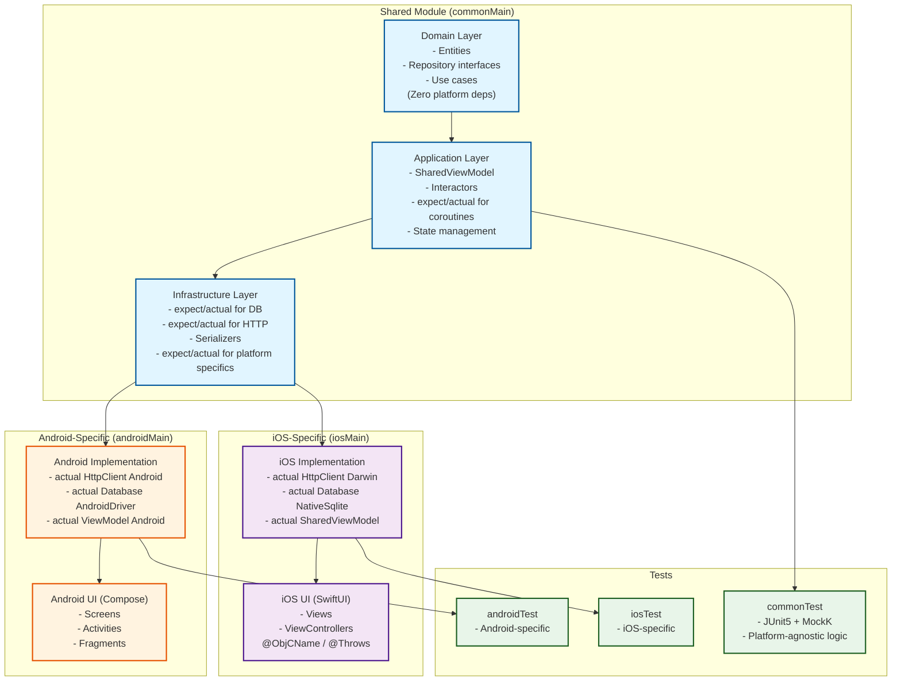
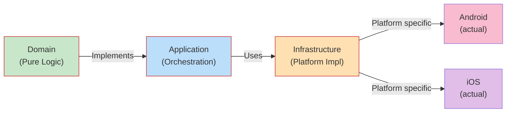
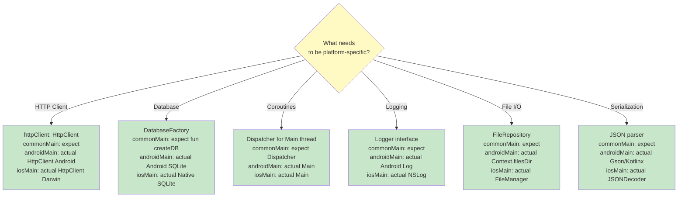
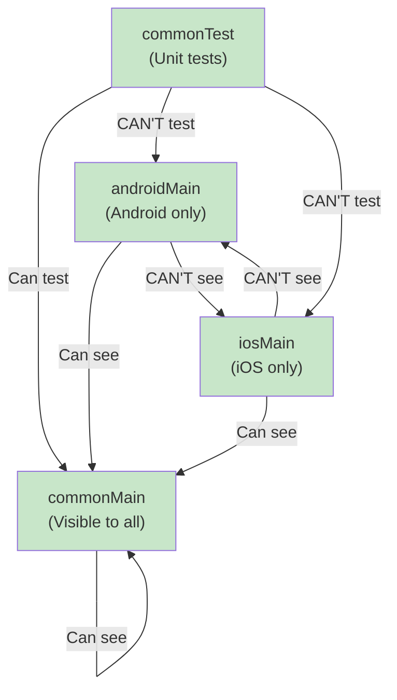
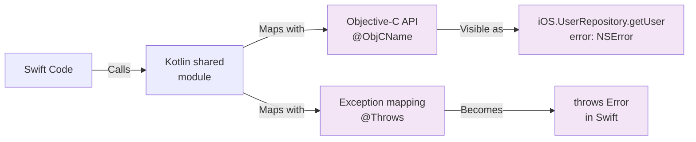
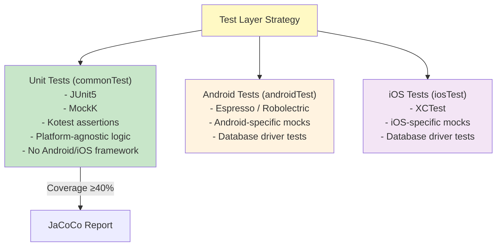
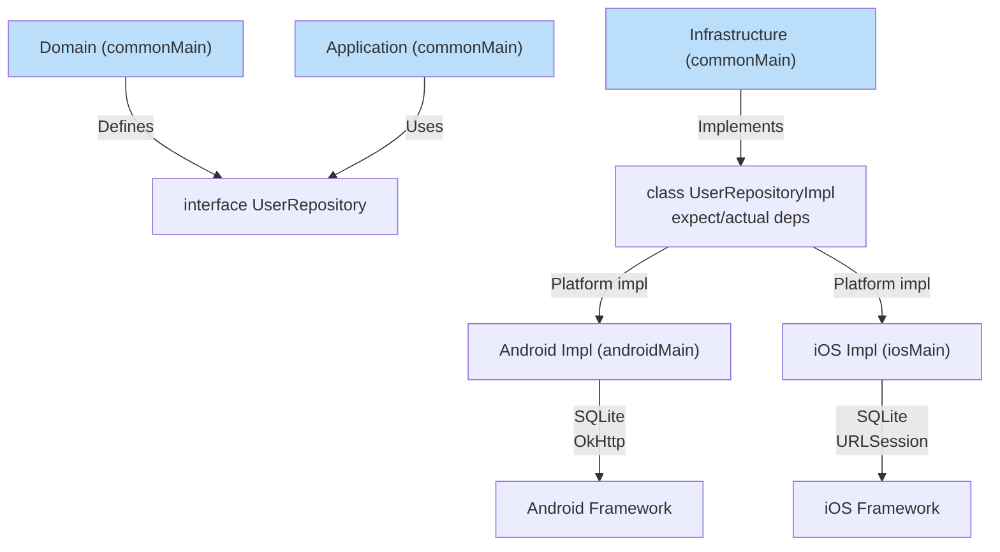

# KMP Shared Module Architecture Overview

## Typical Multiplatform Project Structure



## Dependency Flow (Clean Architecture Rule)



**Golden Rule:** Imports flow `Domain ← App ← Infrastructure ← Platform`. Never reverse.

## expect/actual Placement Guide



## expect/actual Pattern Template

```kotlin
// ============ commonMain/kotlin/com/example/shared/DataLayer.kt ============

// ✅ Interface in commonMain (contract visible to domain)
expect interface UserRepository {
    suspend fun getUser(id: String): User
    suspend fun saveUser(user: User)
}

// ✅ expect function for platform-specific logic
expect fun createDatabaseConnection(): DatabaseConnection

// ❌ DON'T: Platform-specific class in commonMain
// expect class AndroidDatabase { }  // ← WRONG

// ============ androidMain/kotlin/com/example/shared/DataLayer.kt ============

// ✅ actual implementation for Android
actual class UserRepositoryImpl(
    private val db: SQLiteDatabase,
    private val httpClient: HttpClient
) : UserRepository {
    actual override suspend fun getUser(id: String): User = ...
    actual override suspend fun saveUser(user: User) { ... }
}

actual fun createDatabaseConnection(): DatabaseConnection =
    AndroidDatabase(context, "app.db")

// ============ iosMain/kotlin/com/example/shared/DataLayer.kt ============

// ✅ actual implementation for iOS
actual class UserRepositoryImpl(
    private val db: NativeDatabase,
    private val httpClient: HttpClient
) : UserRepository {
    actual override suspend fun getUser(id: String): User = ...
    actual override suspend fun saveUser(user: User) { ... }
}

actual fun createDatabaseConnection(): DatabaseConnection =
    iOSDatabase("/var/mobile/Containers/Data/app")
```

## Source Set Visibility Rules



## iOS Interop: @ObjCName and @Throws



## Testing Structure in KMP



## Ktor Client Configuration (Shared)

```kotlin
// commonMain
expect val httpClient: HttpClient

// Usage in domain:
val response = httpClient.get("https://api.example.com/users") {
    header("Authorization", "Bearer token")
}

// androidMain
actual val httpClient: HttpClient = HttpClient(Android) {
    install(ContentNegotiation) { json() }
    install(Logging) {
        logger = Logger.DEFAULT
        level = LogLevel.ALL
    }
}

// iosMain
actual val httpClient: HttpClient = HttpClient(Darwin) {
    install(ContentNegotiation) { json() }
    // Darwin-specific config
}
```

## SQLDelight in Shared Module

```
shared/build.gradle.kts
sqldelight {
    databases {
        create("AppDatabase") {
            packageName.set("com.example.app.db")
            schemaOutputDirectory.set(file("src/commonMain/sqldelight"))
        }
    }
}

src/
├── commonMain/sqldelight/
│   └── com/example/app/User.sq   (Shared SQL queries)
├── androidMain/kotlin/
│   └── DatabaseFactory.kt        (Android driver)
└── iosMain/kotlin/
    └── DatabaseFactory.kt        (iOS driver)
```

## Complete Example: User Repository Pattern



## Guardrail: Circular Dependency Prevention

```mermaid
graph LR
    User["User Entity<br/>(Domain)"]
    Repository["UserRepository<br/>(Domain Interface)"]
    UseCase["GetUserUseCase<br/>(Application)"]
    Impl["UserRepositoryImpl<br/>(Infrastructure)"]
    
    Repository -->|Uses| User
    UseCase -->|Uses| Repository
    Impl -->|Implements| Repository
    Impl -->|Returns| User
    
    ❌["❌ DON'T:<br/>Impl → UseCase<br/>Impl → Domain<br/>Domain → Impl"]
    
    classDef safe fill:#c8e6c9
    classDef danger fill:#ffcdd2
    
    class User,Repository,UseCase,Impl safe
    class ❌ danger
```
